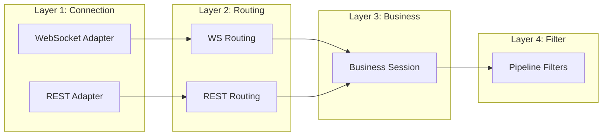

# Four-Layer Architecture Diagram

```mermaid
flowchart LR
    subgraph L1 [Layer 1: Connection]
        ws[WebSocket Adapter]
        rest[REST Adapter]
    end

    subgraph L2 [Layer 2: Routing]
        wsr[WS Routing]
        restr[REST Routing]
    end

    subgraph L3 [Layer 3: Business]
        biz[Business Session]
    end

    subgraph L4 [Layer 4: Filter]
        filt[Pipeline Filters]
    end

    ws --> wsr
    rest --> restr
    wsr --> biz
    restr --> biz
    biz --> filt
```

Each layer maps to the interfaces defined under `core/layers/` and enforces a single direction of data flow from transport adapters to client-facing filters.
